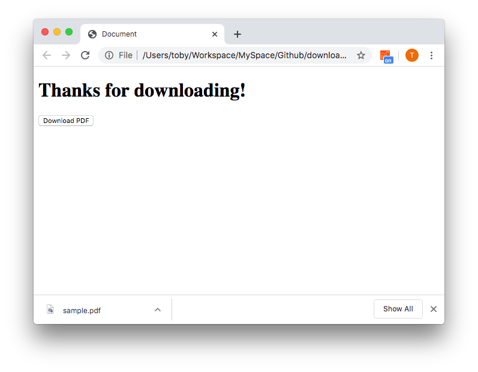

# Download from URL
> How to implement HTML button to download file from any given URL

## Getting started
This project provides JavaScript function to download file from URL using blob.
For exanple when you click PDF link, it should download binary file, not open new tab in the browser.



## How to play

Clone project:

```sh
git clone https://github.com/tobykeod/download-from-url.git
```

Open HTML page in the browser:

```sh
open ./index.html
```

##  Code snippets

```sh
function download(url) {
  var filename = url.substring(url.lastIndexOf('/') + 1);

  fetch(url).then(function (t) {
    return t.blob().then((b) => {
      var a = document.createElement("a");
      a.href = URL.createObjectURL(b);
      a.setAttribute("download", filename);
      a.click();
    });
  });
}
```

## How to use

Add above code snippets into your website JS file.
And call that function any where you want to make the download button.

```
<button onclick="download('http://sample.pdf')">Download PDF</button>
```

That's it!
